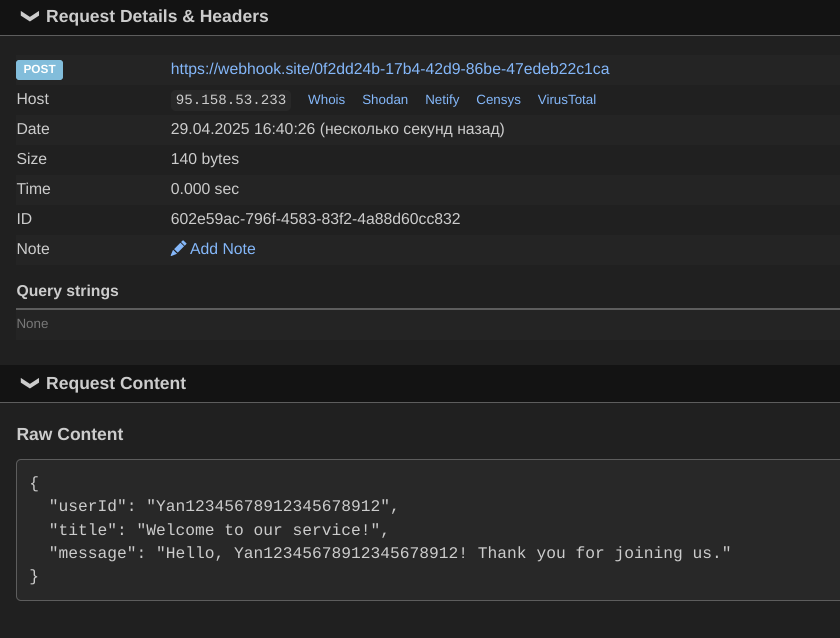

# User Notification Platform

A microservices-based platform that manages users and sends delayed welcome notifications. Built with NestJS, the system consists of three services communicating through RabbitMQ and Redis.

## Services

- **API Gateway** (`api-gateway-svc`) - HTTP API entry point
- **User Service** (`user-svc`) - Manages user data in PostgreSQL
- **Notification Scheduler** (`notification-scheduler-svc`) - Handles delayed notifications using Redis

## Prerequisites

- Docker and Docker Compose
- Node.js 20+
- npm

## Installation

1. Clone the repository
2. Set up environment variables:

```bash
# Copy example env files
cp .env.example .env
cp apps/api-gateway-svc/.env.example apps/api-gateway-svc/.env
cp apps/user-svc/.env.example apps/user-svc/.env
cp apps/notification-scheduler-svc/.env.example apps/notification-scheduler-svc/.env
```

3. Obtain the URL for test notifications:

- Visit webhook.site.

- Copy your unique URL.

- Add that URL to the `NOTIFICATION_SERVICE_URL` environment variable in the "./apps/notification-scheduler-svc/.env" file.

4. Install dependencies:

```bash
# Install dependencies for all services
npm install
```

5. Start the services:
```bash
docker compose up -d
```

## API Endpoints

### Users

```bash
# Create user
curl -X POST http://localhost:3000/gateway-user \
  -H "Content-Type: application/json" \
  -d '{"username": "exampleUserName"}'

# Get all users
curl http://localhost:3000/gateway-user

# Get user by ID
curl http://localhost:3000/gateway-user/1

# Update user
curl -X PUT http://localhost:3000/gateway-user/1 \
  -H "Content-Type: application/json" \
  -d '{"username": "exampleUserName1"}'

# Delete user
curl -X DELETE http://localhost:3000/gateway-user/1
```

### Notifications

1. Create user
```bash
# Create user 
curl -X POST http://localhost:3000/gateway-user \
  -H "Content-Type: application/json" \
  -d '{"username": "exampleUserName"}'
```

2. After this request, the mock notification will be sent after 24 hours. Example:



